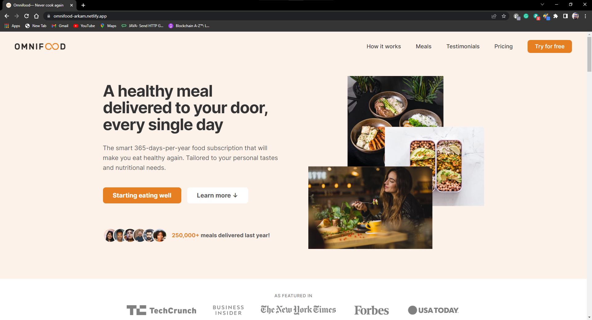
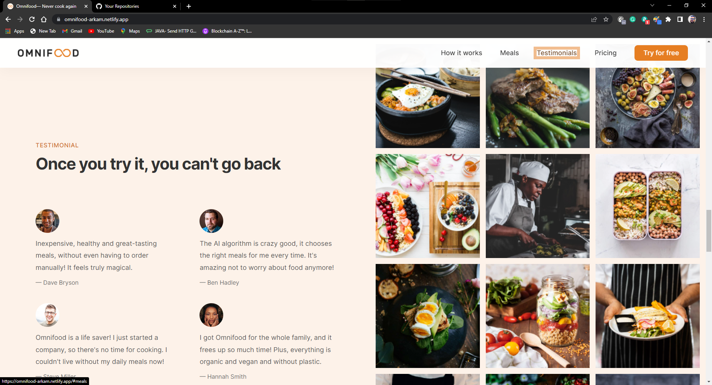
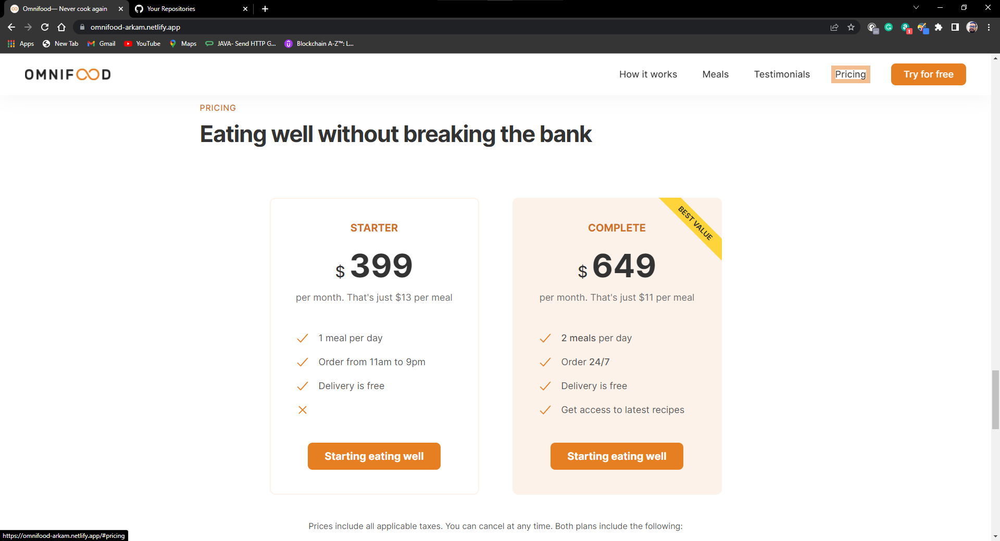
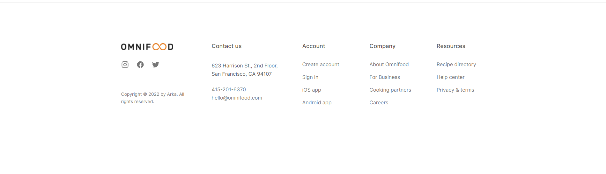

# Omnifood
The smart 📅 365-days-per-year food subscription that will make you eat healthy again.
 

<a href="https://omnifood-arkam.netlify.app">Wesite Link</a>

## About Omnifood

We are a technology company first, but with a major focus on consumer well-being through a healthy diet. Most people are very busy with their jobs, family and friends, and other important activities, which doesn't leave much time for cooking. This might lead to a poor diet and lasting health consequences. We want to solve this problem by using an AI-centric approach. Users can use our app to select their diet and foods they like and dislike, and our AI algorithm will create a custom and individual weekly meal plan. But we don't stop there. We partner with restaurants and other cooking partners to actually cook and deliver all meals from the generated meal plans, in selected cities. All this will be packed up in a monthly subscription, 
where users can choose between receiving one or two meals per day, every single day of the month.

<h3>Below are some of the image of the wesite in browser</h3>

<ul>
  <li>

Home Screen

  
  </li>
    <li>

How It Work Section

  
  </li>
    <li>

Meals Section

  
  </li>
    <li>

Testimonials Section

  
  </li>
    <li>

Pricing Section

  
  </li>
      <li>

Newsletter

  
  </li>
       <li>

Footer Section

  
  </li>
</ul>

